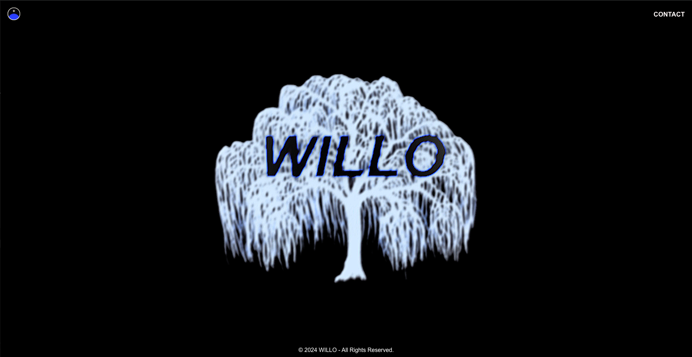

# WILLO Website

Welcome to the WILLO website repository. This is a React application that showcases a simple interactive landing page.

## Introduction

The WILLO website is a minimalist landing page designed to provide users with a smooth visual experience. When the user clicks on the tree image, a background image slowly appears over 5 seconds to 90% transparency and remains visible. The site also includes contact information and links to social media.

## Features

- **Interactive Background Fade-in:** Clicking the tree image triggers a smooth transition of the background image appearing over 5 seconds.
- **Responsive Design:** The website adapts to different screen sizes, including mobile devices.
- **Contact Information Popup:** Users can view contact information by clicking on the "CONTACT" text.
- **External Links:** The logo redirects users to the WILLO Instagram page.

## Technologies Used

- **React:** A JavaScript library for building user interfaces.
- **CSS3:** For styling and layout.
- **React Router DOM:** Handling in-app routing (currently minimal usage).

